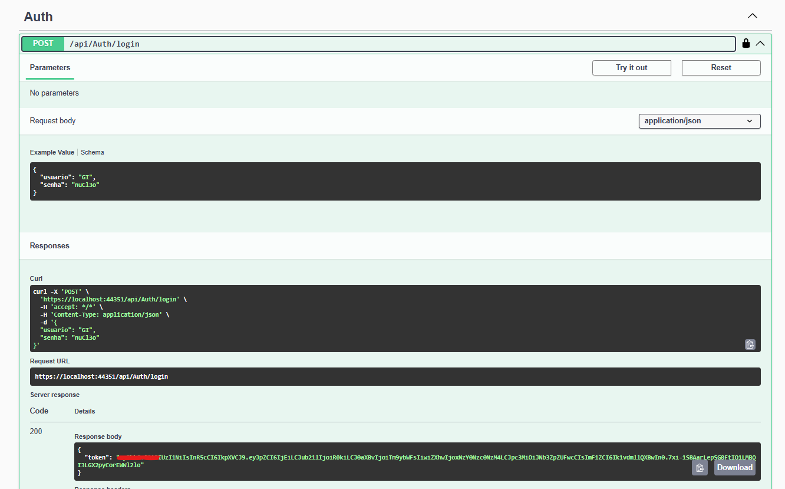
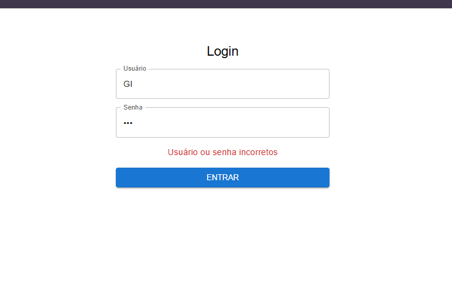
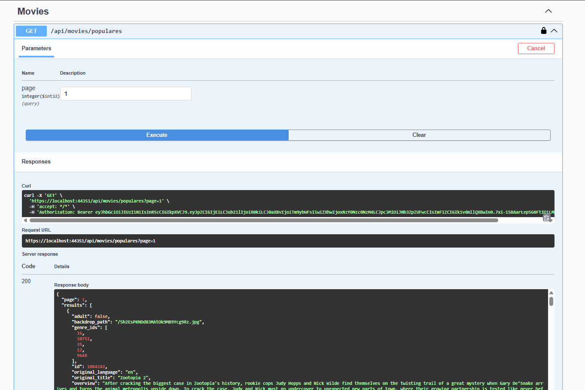

MovieApp
========

Descrição do Projeto
-------------------
MovieApp é uma aplicação completa para consulta de filmes, utilizando a API do TMDB. 
Possui funcionalidades de login, listagem de filmes populares, busca, visualização de detalhes, elenco e trailers.

Funcionalidades principais:
- Autenticação via JWT.
- Listagem de filmes populares com paginação.
- Busca de filmes.
- Página de detalhes de cada filme, incluindo elenco e trailers.
- Logging de requisições.
- Backend em ASP.NET Core e Frontend em React.

Instruções de Instalação
------------------------
1. Clone o repositório:

   git clone https://github.com/seu-usuario/MovieApp.git

2. Backend:
- Abra a pasta `API` no Visual Studio.
- Restaure os pacotes NuGet.
- Configure a connection string em `appsettings.json` para o SQLite:

  "ConnectionStrings": {
    "DefaultConnection": "Data Source=movieapp.db"
  }

- **Chaves sensíveis (JWT e TMDB API Key):**
  - Não comitar essas chaves! Use um arquivo `appsettings.Development.json` (que deve estar no .gitignore) com:

    "Jwt": {
      "Key": "SUA_CHAVE_JWT_AQUI",
      "Issuer": "MovieApp"
    },
    "Tmdb": {
      "ApiKey": "SUA_API_KEY_TMBD_AQUI"
    }

- Rode as migrações do EF Core:
  
  dotnet ef database update --project Infrastructure --startup-project API

3. Frontend:
- Abra a pasta `Frontend`.
- Crie um arquivo `.env.local` (não comitar!) com:

  VITE_TMDB_API_KEY=SUA_API_KEY_TMBD_AQUI

- Instale as dependências:

  cd Frontend
  npm install

- Rode a aplicação:

  npm start

Instruções de Execução
----------------------
- Backend: execute via Visual Studio (F5) ou `dotnet run` dentro da pasta `API`.
- Frontend: `npm start` para rodar em `http://localhost:3000`.

Tecnologias Utilizadas
---------------------
- Backend: ASP.NET Core (.NET 9), Entity Framework Core, JWT, Serilog, Swagger/Swashbuckle
- Frontend: npm/Node.js, React, Axios, React Router, Material UI
- Banco de Dados: SQLite
- Teste Unitário: xUnit, Moq, Microsoft.AspNetCore.Mvc.Testing
- API externa: The Movie Database (TMDB)

Estrutura do Projeto
-------------------
- `API/` : Backend da aplicação.
  - `Controllers/` : Endpoints da API.
  - `Middleware/` : Middlewares (logging, tratamento de erros).
  - `Services/` : Lógica de negócio.
  - `Infrastructure/` : Repositórios e integração com DB e API externa.
  - `Core/` : Entidades e interfaces.
- `Frontend/` : Aplicação React.
  - `src/components/` : Componentes genéricos.
  - `src/pages/` : Páginas principais (Home, Detalhes, Login).
  - `src/services/` : Comunicação com API.
  - `src/hooks/` : Hooks customizados.
  - `src/utils/` : Funções utilitárias.

Como obter a API key do TMDB
-----------------------------
1. Acesse: https://www.themoviedb.org/
2. Crie uma conta ou faça login.
3. Vá em Configurações > API > Solicitar API Key.
4. Copie a API Key gerada e coloque:
   - Backend: em `appsettings.Development.json` ou variáveis de ambiente.
   - Frontend: em `.env.local` como `VITE_TMDB_API_KEY=SUA_API_KEY`.

Observações Importantes
-----------------------
- **Nunca comite chaves sensíveis** em repositórios públicos.
- O projeto já está configurado para ler as chaves do `appsettings.Development.json` e `.env.local`.
- Para rodar em outro computador, cada usuário precisa criar seus próprios arquivos de configuração com as chaves dele.

Gifs e Prints da Execução
-------------------------

  
  
  
